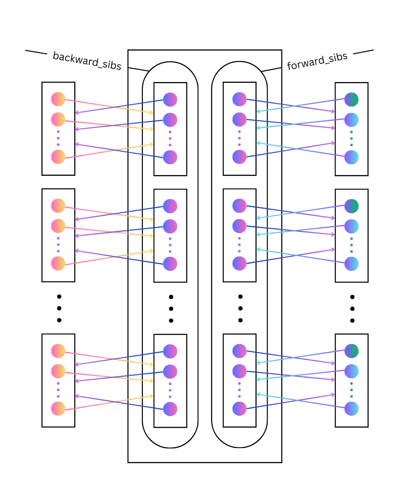
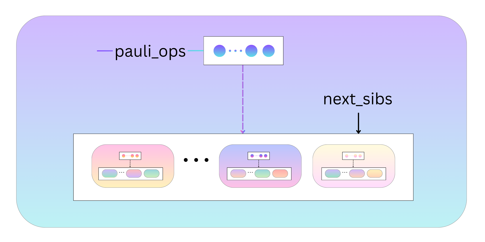

# Lemma 8 Implementation: Toward a Polynomial-Time Classical Simulation of Noisy Random Circuit Sampling

A Python implementation of the algorithm described in Lemma 8 from the work of [Aharonav et al.](https://arxiv.org/pdf/2211.03999) Constructs a list of all possible legal Pauli paths given the depth, number of qubits, gate positions, and upperbound on Hamming weight for a 2D architecture quantum circuit.

---

## Table of Contents

- [Introduction](#introduction)
- [Architecture Overview](#architecture-overview)
- [Class Documentation](#class-documentation)
  - [PauliOperator](#pauli_operatorpy)
  - [PauliOpLayer](#pauli_op_layerpy)
  - [PauliPathTrav](#pauli_path_travpy)
  - [CircuiSim](#circuit_simpy)
  - [TestCircuit](#test_circuitpy)

---

## Introduction

This program plays a key role in classically simulating noisy random circuit sampling in polynomial time. It accomplishes this by using an approach known as the Pauli path method. 

A Pauli path $s = (s_0, \ldots, s_d) \in \mathcal{P}_n^{d+1}$ is a sequence of Pauli operators representing the evolution of quantum states during a circuit's operation. Pauli paths are used to calculuate the Pauli path integral, which is a means of calculating the output probability distribution of the circuit. The Pauli path integral is defined as follows, according to the work of [Aharonav et al.](https://arxiv.org/pdf/2211.03999)

   >### Definition 1 (Pauli Path Integral)
   > Let $C = U_d U_{d-1} \cdots U_1$ be a quantum circuit acting on $n$ qubits, where $U_i$ is a layer of 2-qubit gates and $d$ is the circuit depth. The Pauli path integral is written as: 
   >
   > $$p(C, x) = \sum_{s_0, \ldots, s_d \in \mathcal{P}_n} \text{Tr}(|x\rangle \langle x| s_d) \, \text{Tr}(s_d U_d s_{d-1} U_d^\dagger) \cdots \text{Tr}(s_1 U_1 s_0 U_1^\dagger) \, \text{Tr}(s_0 | 0^n \rangle \langle 0^n |).$$

Note that $p(C, x) = |\langle x | C | 0^n \rangle|^2$ is the output probability distribution for outcome $x$. 

---

## Architecture Overview

1. **Core Classes**:
   - [PauliOperator](#pauli_operatorpy): Stores a Pauli operator, the list of all `PauliOperator` objects that can precede this operator in a legal Pauli path, and a list of those that can come after it. Can generate both of these lists. Each Pauli operator is represented as a list of strs, where each str represents which Pauli matrices can be at that particular index in the tensor product comprising the Pauli operator.
   - [PauliOpLayer](#pauli_op_layerpy): Keeps track of all the `PauliOperator` objects that can be the ith Pauli operator in a legal Pauli path, restricted by the circuit architecture and weight configuration. Uses two hash maps, one containing lists sorted according to which `PauliOperator` objects propagate backward to the same list of `PauliOperator` objects and one sorted according to which `PauliOperator` objects propagate forward to the same `PauliOperator` list.
   - [PauliPathTrav](#pauli_path_travpy): For traversing different possibile branches of our Pauli path. Builds a list of `PauliOpLayer` objects, where the ith `PauliOpLayer` in the list contains all the possibilities for the ith Pauli operator of the Pauli path.
   - [CircuitSim](#circuit_simpy): Constructs a list of all possible `PauliPathTrav` objects for a given circuit architecture and upperbound on Hamming weight.
   - [SiblingOps](#sibling_opspy): Builds a list (`next_ops`) of all `SiblingOps` objects that can come after this SiblingOps` to form valid Pauli path traversals.
2. **Testing**:
   - [TestCircuits](#test_circuitspy): A suite of tests to validate functionality, both in general use cases and edge cases. Restricted to circuits with 0 to 25 qubits.

---

## Class Documentation

---

### pauli_operator.py

**List of Strs Representation**\
Each Pauli operator is a tensor product of matrices drawn from the $2 \times 2$ Paulis $X$, $Y$, $Z$, and $I$. Accordingly, the `PauliOperator` class represents a Pauli operator by a list of strs (the `operator` attribute), where the ith str in the list characterizes the ith Pauli in the tensor product. Below are the different strs that can show up in the list along with what they specify. 
   - "I": The associated Pauli matrix is the $2 \times 2$ identity matrix.
   - "R": The Pauli matrix can be either $X$, $Y$, or $Z$ (any of the non-identity Paulis).
   - "N": The Pauli matrix must be the same as the Pauli at the same index in the next Pauli operator in the path. We use "N" in the case where there is a non-identity Pauli whose associated qubit is not sent into any gates between this operator and the next, so it must not change between layers.
   - "P": The Pauli matrix is specified by whatever the Pauli is at the same index in the prior Pauli operator in the path. This is for the case of a non-identity Pauli whose related qubit does not enter any gates between this Pauli operator and the prior one.

We use "R", "N", and "P" rather than directly including "X", "Y", and "Z" in order to avoid blowing up in memory. Since each "R" encapsulates the possibility of "X", "Y", or "Z", our number of Pauli paths to store is exponentially less than it would be if we opted 
to store each individual combination of choosing either "X", "Y", or "Z" for all of "R"s in our list. \
\
\
**Immediate Neighbors**\
It is also essential that we situate each Pauli operator in terms of its neighbors in a legal Pauli path. Thus, we store a reference (`prior_ops`) to the `PauliOperator` objects that can directly precede this `PauliOperator` in a legal Pauli path. Likewise, we maintain an attribute (`next_ops`) for the `PauliOperator` objects that can come directly after this `PauliOperator`.

**Initialization**\
   `PauliOperator(operator:List[str], prior_ops:List[PauliOperator] = None, next_ops:List[PauliOperator] = None):`
   >Instantiates a PauliOperator object with its `operator` attribute initialized, and its `prior_ops` and `next_ops` attributes initialized if those parameters were included in the call.

**Attributes**
   - `operator`: A list of strs representing this `PauliOperator`, consisting of "I"s, "R"s, "N"s, and "P"s.
   - `prior_ops`: A list containing all `PauliOperator` objects that can directly precede this `PauliOperator` in a legal Pauli path.
   - `next_ops`: A list containing each of the `PauliOperator` objects that could come directly after this `PauliOperator` in a legal Pauli path.
   - `list_alloc`: A 2D array, where `list_alloc[i,j]` is the number of ways we
   can fill i gates with non-identity I/O using an overall Hamming weight of j
   - `xyz_paulis`: A list of str lists, where each str list is a distinct permutation of assigning either "X", "Y", or "Z" to each of the "R"s in our `PauliOperator` object's operator

**Methods:**

- **`weight_to_operators(sib_ops: List[PauliOperator], next_weight: int, pos_to_fill: List[tuple], backward: int)`**  
  If `backward` is 1, this method determines all possible `PauliOperator` objects that can directly precede the given `PauliOperator` in a legal Pauli path. These objects are appended to the `prior_ops` attribute of the class. Otherwise, it determines all possible `PauliOperator` objects that can directly follow the given one in a legal Pauli path and appends them to the `next_ops` attribute.

- **`list_allocs(num_p: int, num_w: int)`**  
  A static method that calculates the number of ways to distribute `num_w` (the total Hamming weight) across `num_p` non-identity gate positions. It returns a 2D integer array where each entry `(i, j)` represents the number of ways to fill `i` gates with a total Hamming weight of `j`.

- **`find_next_operators(sibs: List[PauliOperator], num_RRs: int, pos_to_fill: List[tuple], r_start: int)`**  
  A helper method of `weight_to_operators` which recursively fills the next non-identity I/O gate positions with either "I" and "R", "R" and "I", or "R" and "R", until we reach the bases case where `num_RRs` is 0 or the number of positions left to fill is equal to `num_RRs`.

- **`edit_ops(sibs: List[PauliOperator], indices: tuple, strs: tuple, r_start: int, r_end: int)`**  
  A static method that fills the first index of `indices` with the first str of `strs` and the second index with the second str for the `operator` attribute of all `PauliOperator` objects of `sibs` in the range [`r_start`,`r_end`).

---

### pauli_op_layer.py

**Sorting for Propagation**\
We store all the possibile Pauli paths in terms of layers. At each layer, we store all the `PauliOperator` objects which could be the Pauli operator for a particular position in a legal Pauli path. We group `PauliOperator` objects at this `PauliOperator` layer in "family" lists according to which propagate backward to the same list of `PauliOperator` objects at the prior `PauliOperator` layer. We store each such "family" list in a DefaultDict (`backward_sibs`), where the "family" list is the value and the key is a tuple of the list of non-identity gate positions between any `PauliOperator` in the "family" list and all of the `PauliOperator` objects in the list it propagates backward to, along with a List of strs representing the non-gate qubits between any `PauliOperator` in this "family" list and any of the `PauliOperator` objects the prior propagation list. `forward_sibs` is a DefaultDict with the same set up except that it stores "family" lists sorted based on which `PauliOperator` objects propagate forward to the same list of possibilities at the *next* layer.

**Initialization**\
   `PauliOpLayer(gate_pos:List[tuple]=None, backward:int=-1,pauli_ops:DefaultDict[tuple, List[PauliOperator]]=None)`

**Attributes**
   - `backward`: An int that is 1 if we need to propagate backward from this `PauliOpLayer` and 0 otherwise.
   - `gate_pos`: A list of int tuples, where each int tuple stores the two I/O indices of a gate between this PauliOpLayer and either the prior PauliOpLayer (if backward) or the next `PauliOpLayer` (otherwise).
   - `pos_to_fill`: A DefaultDict whose keys are the `PauliOperator` objects at this `PauliOpLayer` and whose values are lists of int tuples containing the non-identity I/O gate positions between the `PauliOperator` key and the `PauliOpLayer` to which we're propagating.
   - `forward_sibs`: A DefaultDict that sorts all the `PauliOperator` objects at this `PauliOpLayer` according to their having matching gate positions with non-identity I/O and the same non-gate qubits when propagating forward. The non-identity I/O gate positions list and the list of non-gate qubit strs are both converted into tuples and used as the key for the DefaultDict. The list of "family" PauliOperator objects is the value for the DefaultDict.
   - `bacward_sibs`: A DefaultDict with the same setup as `forward_sibs` except that it is sorted according to matching the attributes when propagating backward. Both `forward_sibs` and `backward_sibs` enjoy the property that each of their "family" lists contain a grouping of `PauliOperator` objects that all propagate to the same list of `PauliOperator` objects at a neighboring circuit Layer.
   - `carry_over_qubits`: A list of lists of strs, where each list of strs is a copy of one the `PauliOperator` object's operator at this `PauliOpLayer` with the edit that its qubits at gate positions are all set to "I". This allows us to check equality of non-gate qubits for `PauliOperator` objects by simply comparing their lists in `carry_over_qubits`. 

**Methods**
   - **`check_qubits(unsorted_pauli_ops:List[PauliOperator])`**\
   Uses the attribute `gate_pos` to determine which gate positions have non-identity I/O, for each `PauliOperator` in `unsorted_pauli_ops`, in order to fill out the attribute `pos_to_fill`. Also uses `gate_pos` to correctly edit `carry_over_qubits` so that each of its entries only characterizes non-gate qubits, for each `PauliOperator` in `unsorted_pauli_ops`. 

   - **`find_sibs(unsorted_pauli_ops:List[PauliOperator])`**\
   Relies on the information obtained from calling `check_qubits` to sort all the `PauliOperator` objects of this `PauliOpLayer` into lists according to which have the same set of non-gate qubits and non-identity I/O gate positions. Accomplishes that using a DefaultDict where the keys are tuples comprised of a `PauliOperator` object's associated entry of `pos_to_fill` and `carry_over_qubits`. 

---

### pauli_path_trav.py

**Overview**\

**Initialization**\
   `PauliPathTrav(num_qubits:int, weight_combo:List[int],gate_pos:List[List[tuple]])`

**Attributes**
   - `num_qubits`: An int that is the number of qubits in the circuit.
   - `num_op_layers`: An int representing the number of Pauli operators in any valid Pauli path represented by this `PauliPathTrav`
   - `weight_combo`: A list of ints, where the ith list entry is the required Hamming weight for any ith Pauli operator in a Pauli path of this `PauliPathTrav`.
   - `gate_pos`: A list of lists of int tuples, where the ith list of int tuples contains the gate positions between the ith and i+1st Pauli operators.
   - `layers`: A list of `PauliOpLayer` objects, where the ith `PauliOpLayer` object keeps track of all possible ith Pauli operators in our Pauli path.

**Methods**
   - `build_min_configs()`
   - `unsorted_min_layer_ops(min_weight)`
   - `min_backward(min_layers:List[PauliOperator],min_depth:int)`
   - `min_forward(min_layers:List[PauliOperator],min_layer_ops:PauliOplayer,min_depth:int)`
   - `propagate_next(all_sibs:DefaultDict[tuple, List[PauliOperator]], pos_to_fill:DefaultDict[PauliOperator,List], backward:int, depth:int)`
   

---

### sibling_ops.py

**Overview**

\
The `SiblingOps` class uses a recursive structure to generate Pauli paths.

**Initialization**\
   `SiblingOps(pauli_ops:List[PauliOperator],next_index:int,pauli_path:List[PauliOperator])`

**Attributes**
   - `pauli_ops`: The list of `PauliOperator` objects for a particular index in the Pauli path that have the same selection from "X", "Y", and "Z" for their non-gate non-identity qubits.
   - `next_sibs`: A list of `SiblingOps` objects, where the `pauli_ops` attribute of each of these `SiblingOps` contains all the `PauliOperator` objects that could come directly after any of the `PauliOperator` objects in a valid Pauli path.

**Methods**
   - `rnp_to_xyz(next_index:int, pauli_path:List[PauliOperator])`: 
   - `fill_pos_lists(next_op:PauliOperator, r_pos_list: List[int], n_pos_list: List[int])`: 
   - `fill_in_pos(filled_pos:List[PauliOperator],pos_list:List[int], pauli:str, index:int, start:int)`:
   - `carries_to_the_end(cur_op:PauliOperator, i:int)`:
   - `rp_to_z(next_op:PauliOperator, pauli_path:List[PauliOperator])`:

---

### circuit_sim.py

**Overview**

The `CircuitSim` class represents a classical simulation of a noisy random circuit. Its constructor initiailizes a list of all possible `PauliPathTrav` objects, given the circuit architecture and an upperbound on Hamming weight.

**Initialization**\
   `CircuitSim(num_qubits:int, l:int, gate_pos:List[List[tuple]])`

**Attributes**
   - `num_qubits`: An int that is the number of qubits in the circuit.
   - `num_op_layers`: An int that is the number of Pauli operators in any of the circuit's valid Pauli paths, which equals the number of gates in the circuit plus 1.
   - `gate_pos`: A list of list of int tuples, where the ith list of int tuples represents all the gate positions in the ith gate layer of the circuit.
   - `max_weight`: An int that is the upper bound on the total Hamming weight of any Pauli path used for the simulation.
   - `weight_combos`: A list of lists of ints, where each list of ints represents an indexed assignment of weights to Pauli operators in a legal Pauli path.
   - `pauli_paths`: A list of all possible PauliPathTrav objects, given the upper bound on Hamming weight and circuit architecture.

**Methods**
   - `valid_gate_pos(num_qubits:int, gate_pos:List[List[tuple]])`: A static method that checks whether the specified number of qubits (`num_qubits`) and gate position array (`gate_pos`) comprise a valid circuit architecture.
   - `enumerate_weights(weight_list:List[int], wiggle_room:int, num_layers_left:int)`: Recursively fills the `weight_combo` attribute of the `CircuitSim` with each distinct list that specifies the Hamming weights of a legal Pauli path, taking into account the restrictions of the circuit architecture. For each list, the ith int in the list assigns the Hamming weight of the ith Pauli operator of the Pauli path.
   - `init_pauli_paths()`: Initiates the list of all `PauliPathTrav` objects that fit the circuit architecture and upper bound on Hamming weight.
   - `travs_to_list()`: Translates `PauliPathTrav` object list into a list of paths, still in 'R', 'N', 'P', and 'I', and stores the lists in attribute `rnp_pauli_paths`.
   - `trav_to_list(trav:PauliPathTrav)`: Helper function for `travs_to_list()`.
   - `pauli_op_hopping(trav_list:List[List[PauliOperator]], partial_pauli_path:List[PauliOperator], pauli_op:PauliOperator)`: Helper function for `trav_to_list()`.
   - `build_xyz_trees()`: For each Pauli path list in `rnp_pauli_paths`, constructs its corresponding `SiblingOps` tree, with the tree's branching representing different valid selections of 'X', 'Y', and 'Z'. Stores the root of each tree in attribute `sib_op_heads`.
   - `trees_to_lists()`: Turns each tree into seperate lists representing Pauli paths, with the lists being appended to the attribute `xyz_pauli_paths`
   - `branch(cur_sib:SiblingOps, pauli_paths_in_womb:List[List[PauliOperator]])`: Helper function for `trees_to_lists()`
   - `rn_to_z(first_op:PauliOperator)`: A static method that replaces all 'R's and 'N's in the first `PauliOperator` with 'Z's.

   ---

## test_circuit.py
