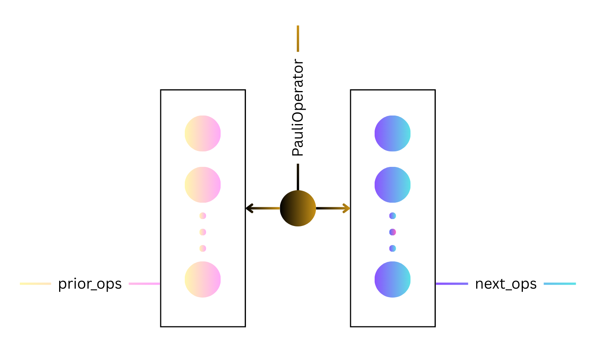
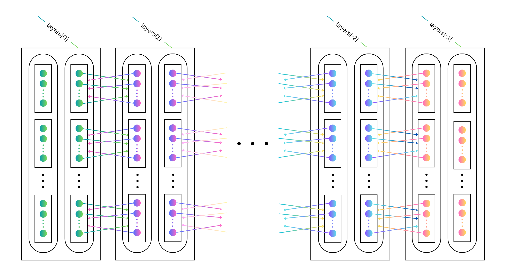

# Lemma 8 Implementation: Toward a Polynomial-Time Classical Simulation of Noisy Random Circuit Sampling

A Python implementation of the algorithm described in Lemma 8 from the work of [Aharonav et al.](https://arxiv.org/pdf/2211.03999) Constructs a list of all possible legal Pauli paths given the depth, number of qubits, gate positions, and upperbound on Hamming weight for a 2D architecture quantum circuit.

---

## Table of Contents

- [Introduction](#introduction)
- [Architecture Overview](#architecture-overview)
- [Class Documentation](#class-documentation)
  - [PauliOperator](#pauli_operatorpy)
  - [PauliOpLayer](#pauli_op_layerpy)
  - [PauliPathTraversal](#pauli_pathpy)
  - [CircuiSimt](#circuit_simpy)
  - [TestCircuit](#test_circuitpy)

---

## Introduction

This program plays a key role in classically simulating noisy random circuit sampling in polynomial time. It accomplishes this by using an approach known as the Pauli path method. 

A Pauli path $s = (s_0, \ldots, s_d) \in \mathcal{P}_n^{d+1}$ is a sequence of Pauli operators representing the evolution of quantum states during a circuit's operation. Pauli paths are used to calculuate the Pauli path integral, which is a means of calculating the output probabaility distribution of the circuit. The Pauli path integral is defined as follows, according to the work of [Aharonav et al.](https://arxiv.org/pdf/2211.03999)

   >### Definition 1 (Pauli Path Integral)
   >
   > Let $C = U_d U_{d-1} \cdots U_1$ be a quantum circuit acting on $n$ qubits, where $U_i$ is a layer of 2-qubit gates and $d$ is the circuit depth. The **Pauli path integral** is written as:
   > $$p(C, x) = \sum_{s_0, \ldots, s_d \in \mathcal{P}_n} \text{Tr}(|x\rangle \langle x| s_d) \, \text{Tr}(s_d U_d s_{d-1} U_d^\dagger) \cdots \text{Tr}(s_1 U_1 s_0 U_1^\dagger) \, \text{Tr}(s_0 | 0^n \rangle \langle 0^n |)$$

Note that $p(C, x) = |\langle x | C | 0^n \rangle|^2$ is the output probability distribution for outcome $x$. 

---

## Architecture Overview

1. **Core Classes**:
   - `PauliOperator`: Stores a Pauli operator and the list of all PauliOperator objects that can precede this operator in a legal Pauli path and a list of those that can come after it. Can generate both of these lists. Each Pauli operator is represented as a list of strings, where each string is either 'I' or 'R'. 'I' is the identity Pauli matrix and 'R' signifies a non-identity Pauli matrix.
   - `PauliOpLayer`: Keeps track of all the PauliOperator objects that can be the ith Pauli operator in a legal Pauli path, restricted by the circuit architecture and weight configuration. Uses two hash maps, one containing lists sorted according to which PauliOperators propagate backward to the same list of PauliOperators and one sorted according to which PauliOperators propagate forward to the same PauliOperator list.
   - `PauliPathTraversal`: Builds a list of PauliOpLayer objects, where the ith PauliOpLayer in the list contains all the possibilities for the ith Pauli operator of the Pauli path.
   - `CircuitSim`: Constructs a list of all possible PauliPathTraversals for a given circuit architecture and upperbound on Hamming weight.
2. **Testing**:
   - `TestCircuit`: A suite of tests to validate functionality, both in general use cases and edge cases. Restricted to circuits with 0 to 25 qubits.

---

## Class Documentation

---

### pauli_operator.py

**Overview**\

**Initialization**\
   `PauliOperator(operator:List[str], prior_ops:List[PauliOperator] = None, next_ops:List[PauliOperator] = None):`\
   >Instantiates a PauliOperator object with its `operator` attribute initialized, and its `prior_ops` and `next_ops` attributes initialized if those parameters were included in the call.

**Attributes**
   - `operator`: A list of strings representing this PauliOperator. There is one string for each qubit in the circuit, and every string is either 'I' or 'R', depending on whether the qubit must be the identity or whether it can be either 'X', 'Y', or 'Z.'
   - `prior_ops`: A list containing all PauliOperator objects that can directly precede this PauliOperator in a legal Pauli path.
   - `next_ops`: A list containing each of the PauliOperator objects that could come directly after this PauliOperator in a legal Pauli path.
   - `list_alloc`: A 2D array, where list_alloc[i,j] is the number of ways we
   can fill i gates with non-identity I/O using an overall Hamming weight of j
   - `r_pos`: A list of ints that stores the indices of all the 'R's in our PauliOperator's operator
   - `xyz_paulis`: A list of string lists, where each string list is a distinct permutation of assigning either 'X', 'Y', or 'Z' to each of the 'R's in our PauliOperator's operator

**Methods**
   - `list_allocs(num_p:int, num_w:int)`: A static method that takes the number of non-identity gate positions we have to fill (`num_p`)
      and the Hamming weight we have to spread across the gate positions (`num_w`). It returns a 2D int array where the (i,j) entry stores the number of ways we can fill i gates with non-identity I/O using a total Hamming weight of j.
   - `edit_operator(sibs:List[PauliOperator],indices:tuple, strs:tuple, r_start:int, r_end:int)`: A static method that 
   - `weight_to_operators(next_weight:int, pos_to_fill:List[tuple], backward:int)`: 
   - `find_next_operators(sibs:List[PauliOperator], num_RRs:int, pos_to_fill:List[tuple], r_start:int)`
   - `r_to_xyz()`
   - `fill_in_r_pos(pauli:str, r_pos_i:int, start:int)`

---

### pauli_op_layer.py

**Overview**\

**Initialization**\
   `PauliOpLayer(gate_pos:List[tuple]=None, backward:int=-1,pauli_ops:DefaultDict[tuple, List[PauliOperator]]=None)`

**Attributes**
   - `backward`: An int that is 1 if we need to propagate backward from this PauliOpLayer and 0 otherwise.
   - `gate_pos`: A list of int tuples, where each int tuple stores the two I/O indices of a gate between this PauliOpLayer and either the prior PauliOpLayer (if backward) or the next PauliOpLayer (otherwise).
   - `pos_to_fill`: A DefaultDict whose keys are the PauliOperator objects at this PauliOpLayer and whose values are lists of int tuples containing the non-identity I/O gate positions between the PauliOperator key and the PauliOpLayer to which we're propagating.
   - `forward_sibs`: A DefaultDict that sorts all the PauliOperators at this PauliOpLayer according to their having matching gate positions with non-identity I/O and the same non-gate qubits when propagating forward. The non-identity I/O gate positions list and the list of non-gate qubit strs are both converted into tuples and used as the key for the DefaultDict. The list of "sibling" PauliOperator objects is the value for the DefaultDict.
   - `bacward_sibs`: A DefaultDict with the same setup as forward_sibs except that it is sorted according to matching the attributes when propagating backward. Both forward_sibs and backward_sibs enjoy the property that each of their "sibling" lists contain a grouping of PauliOperator objects that all propagate to the same list of PauliOperators at a neighboring circuit Layer.
   - `carry_over_qubits`: A list of lists of strs, where each list of strs is a copy of one the PauliOperator's operator at this PauliOpLayer with the edit that its qubits at gate positions are all set to 'I'. This allows us to check equality of non-gate qubits for PauliOperator objects by simply comparing their lists in carry_over_qubits. 

**Methods**
   - `check_qubits(unsorted_pauli_ops:List[PauliOperator])`
   - `find_sibs(unsorted_pauli_ops:List[PauliOperator])`

---

### pauli_path.py

**Overview**\

**Initialization**\
   `PauliPathTraversal(num_qubits:int, weight_combo:List[int],gate_pos:List[List[tuple]])`

**Attributes**
   - `num_qubits`: An int set to the number of qubits in the circuit.
   - `depth`: An int representing the depth of the circuit.
   - `weight_combo`: A list of ints, where the ith list entry is the required Hamming weight for any ith Pauli operator in this Pauli path.
   - `gate_pos`: A list of lists of int tuples, where the ith list of int tuples contains the gate positions between the ith and i+1st Pauli operators.
   - `layers`: A list of PauliOpLayer objects, where the ith PauliOpLayer object keeps track of all possible ith Pauli operators in our Pauli path.

**Methods**
   - `build_min_configs()`
   - `unsorted_min_layer_ops(min_weight)`
   - `min_backward(min_layers:List[PauliOperator],min_depth:int)`
   - `min_forward(min_layers:List[PauliOperator],min_layer_ops:PauliOplayer,min_depth:int)`
   - `propagate_next(all_sibs:DefaultDict[tuple, List[PauliOperator]], pos_to_fill:DefaultDict[PauliOperator,List], backward:int, depth:int)`

---

### circuit_sim.py

**Overview**

The `CircuitSim` class represents a classical simulation of a noisy random circuit. Its constructor initiailizes a list of all possible PauliPathTraversal objects, given the circuit architecture and an upperbound on Hamming weight.

**Initialization**\
   `CircuitSim(num_qubits:int, l:int, gate_pos:List[List[tuple]])`

**Attributes**
   - num_qubits: An int that is the number of qubits in the circuit.
   - num_op_layers: An int that is the number of Pauli operators in any of the circuit's valid Pauli paths, which equals the number of gates in the circuit plus 1.
   - gate_pos: A list of list of int tuples, where the ith list of int tuples represents all the gate positions in the ith gate layer of the circuit.
   - max_weight: An int that is the upper bound on the total Hamming weight of any Pauli path used for the simulation.
   - weight_combos: A list of lists of ints, where each list of ints represents an indexed assignment of weights to Pauli operators in a legal Pauli path.
   - pauli_paths: A list of all possible PauliPathTraversal objects, given the upper bound on Hamming weight and circuit architecture.

**Methods**
   - init_pauli_paths()
   - enumerate_weights(weight_list:List[int], wiggle_room:int, num_layers_left:int)

---

## test_circuit.py
