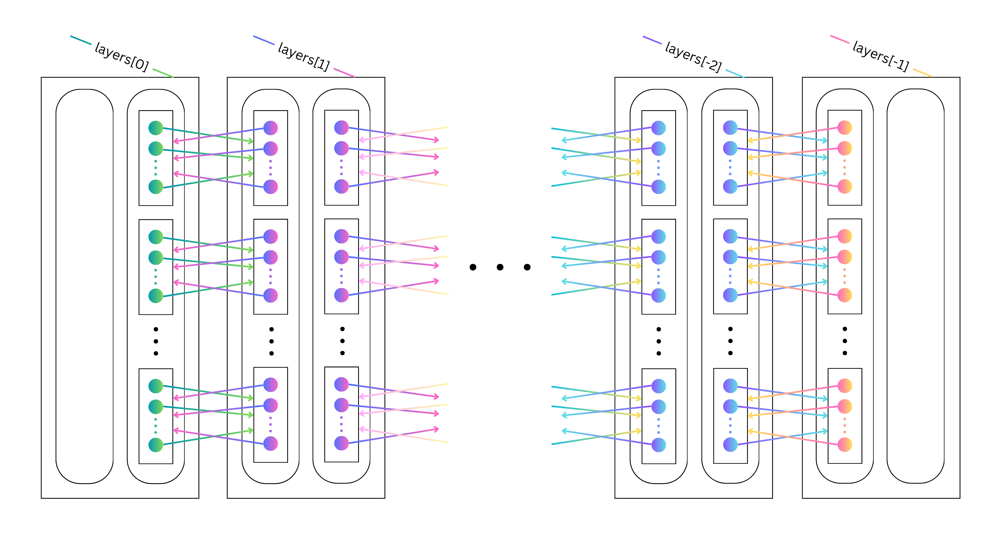

# Lemma 8 Implementation: Toward a Polynomial-Time Classical Simulation of Noisy Random Circuit Sampling

A Python implementation of the algorithm described in Lemma 8 from the paper "[A polynomial-time classical algorithm for noisy random circuit sampling.](https://arxiv.org/pdf/2211.03999)" Constructs a list of all possible legal Pauli paths given the depth, number of qubits, gate positions, and upperbound on Hamming weight for a 2D architecture quantum circuit.

---

## Table of Contents

- [Introduction](#introduction)
- [Architecture Overview](#architecture-overview)
- [Class Documentation](#class-documentation)
  - [PauliOperator](#pauli_operatorpy)
  - [Layer](#layerpy)
  - [PauliPath](#pauli_pathpy)
  - [Circuit](#circuitpy)
  - [TestCircuit](#test_circuitpy)

---

## Introduction

The **Lemma 8 Implementation** plays a key role in classically simulating noisy random circuit sampling in polynomial time. 

---

## Architecture Overview

1. **Core Classes**:
   - `PauliOperator`: Stores a Pauli operator and the list of all PauliOperators it can propagate forward to and a list of the ones to which it can propagate backward. Can generate the forward and/or backward list. Each Pauli operator is represented as a list of strings, where each string is either 'I' or 'R'. 'I' is the identity Pauli matrix and 'R' can be 'X', 'Y', or 'Z.'
   - `Layer`: Stores all of the PauliOperators at a specific layer in two hash maps, one with the lists sorted according to which PauliOperators propagate backward to the same list of PauliOperators and one sorted according to which PauliOperators propagate forward to the same PauliOperator list.
   - `PauliPath`: Builds a list of Layer objects representing each layer of a circuit given a specific weight configuration.
   - `Circuit`: Constructs a list of all possible PauliPaths for a given circuit architecture and upperbound on Hamming weight.
2. **Testing**:
   - `TestCircuit`: A suite of tests to validate functionality, both in general use cases and edge cases. Restricted to circuits with 0 to 25 qubits.

---

## Class Documentation

---

### pauli_operator.py

**Overview**\

**Initialization**\
   `PauliOperator(operator:List[str], backward_ops:List[PauliOperator] = None, forward_ops:List[PauliOperator] = None)`

**Attributes**
   - `operator`: A list of strings representing this PauliOperator. There is one string for each qubit in the circuit, and every string is either 'I' or 'R', depending on whether the qubit must be the identity or whether it can be either 'X', 'Y', or 'Z.'
   - `backward_ops`: A list containing all PauliOperator objects that can directly precede this PauliOperator in a legal PauliPath.
   - `forward_ops`: A list containing each of the PauliOperator objects that could come directly after this PauliOperator in a legal PauliPath.
   - `list_alloc`: A 2D array, where list_alloc[i,j] is the number of ways we
   can fill i gates with non-identity I/O using an overall Hamming weight of j
   - `r_pos`: A list of integers that stores the indices of all the 'R's in our PauliOperator's operator
   - `xyz_paulis`: A list of string lists, where each string list is a distinct permutation of assigning either 'X', 'Y', or 'Z' to each of the 'R's in our PauliOperator's operator

**Methods**
   - `weight_to_operators(next_weight:int, pos_to_fill:List[tuple], backward:int)`
   - `list_allocs(num_p:int, num_w:int)`: A static methof
   - `edit_operator(sibs:List[PauliOperator],indices:tuple, strs:tuple, r_start:int, r_end:int) = static`
   - `find_next_operators(sibs:List[PauliOperator], num_RRs:int, pos_to_fill:List[tuple], r_start:int)`
   - `r_to_xyz()`
   - `fill_in_r_pos(pauli:str, r_pos_i:int, start:int)`

---

### layer.py

**Overview**\

**Initialization**\
   `Layer(gate_pos:List[tuple]=None, backward:int=-1,pauli_ops:DefaultDict[tuple, List[PauliOperator]]=None)`

**Attributes**
   - backward
   - gate_pos
   - forward_sibs
   - bacward_sibs
   - pos_to_fill
   - carry_over_qubits

**Methods**
   - check_qubits(unsorted_pauli_ops:List[PauliOperator])
   - find_sibs(unsorted_pauli_ops:List[PauliOperator])

---

### pauli_path.py

**Overview**\

**Initialization**\
   `PauliPath(num_qubits:int, weight_combo:List[int],gate_pos:List[List[tuple]])`

**Attributes**
   - num_qubits
   - depth
   - weight_combo
   - gate_pos
   - layers

**Methods**
   - build_min_configs()
   - unsorted_min_layer_ops(min_weight)
   - min_backward(min_layers,min_depth)
   - min_forward(min_layers,min_layer_ops,min_depth)
   - propagate_next(all_sibs:DefaultDict[tuple, List[PauliOperator]], pos_to_fill:DefaultDict[PauliOperator,List], backward:int, depth:int)

---

### circuit.py

**Overview**

**Initialization**\
   `Circuit(num_qubits:int, num_layers:int, l:int, gate_pos:List[List[tuple]])`

**Attributes**
   - num_qubits
   - num_layers
   - gate_pos
   - max_weight
   - weight_combos
   - pauli_paths

**Methods**
   - init_pauli_paths()
   - enumerate_weights(weight_list:List[int], wiggle_room:int, num_layers_left:int)

---

## test_circuit.py
